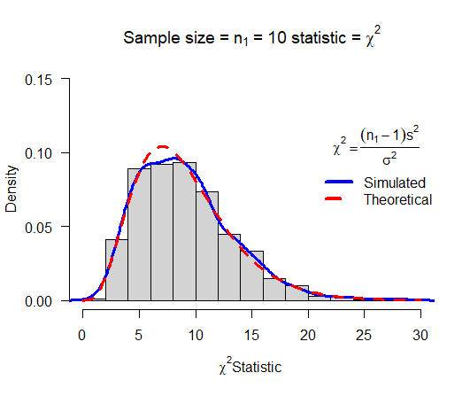
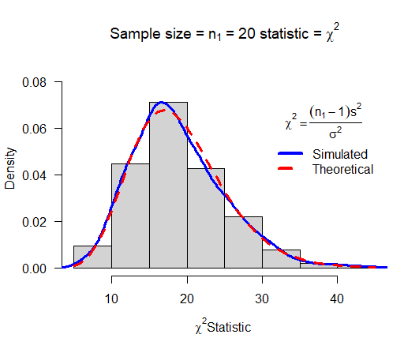
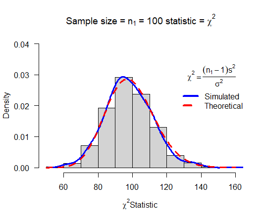
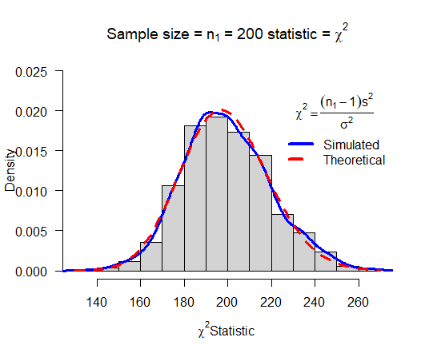
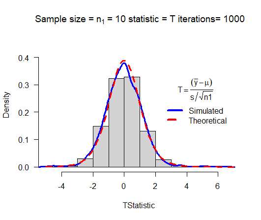
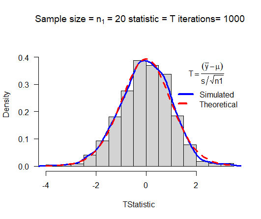
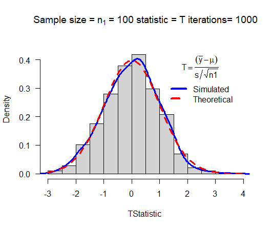
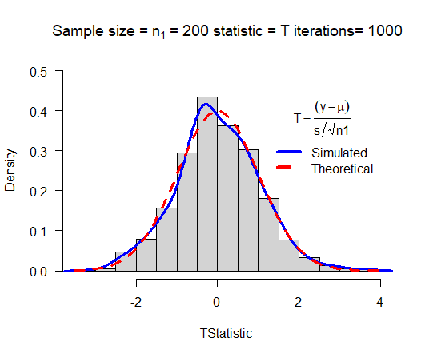

# Task 1
```{r}
  getwd()
```

# Task 2

## Plots with different sizes

### $n_1=10$


### $n_1=20$


### $n_1=100$


### $n_1=200$


## Histogram of chisq
```{r}
  # mychisim function
  mychisim<-function(n1=10,sigma1=3,mean1=5,iter=1000,ymax=0.1,x=20, y=0.1){    # adjust   ymax to make graph fit
  y1=rnorm(n1*iter,mean=mean1,sd=sigma1)# generate iter samples of size n1

  data1.mat=matrix(y1,nrow=n1,ncol=iter,byrow=TRUE) # Each column is a sample size n1

  ssq1=apply(data1.mat,2,var) # ssq1 is s squared

  w=(n1-1)*ssq1/sigma1^2      #chi-sq stat

  hist(w,freq=FALSE, ylim=c(0,ymax), # Histogram with annotation
  main=substitute(paste("Sample size = ",n[1]," = ",n1," statistic = ",chi^2)),
  xlab=expression(paste(chi^2, "Statistic",sep=" ")), las=1)
  lines(density(w),col="Blue",lwd=3) # add a density plot
  curve(dchisq(x,n1-1),add=TRUE,col="Red",lty=2,lwd=3) # add a theoretical curve
  title=expression(chi^2==frac((n[1]-1)*s^2,sigma^2)) #mathematical annotation -see        ?plotmath
  legend(x,y,c("Simulated","Theoretical"),col=c("Blue","Red"),lwd=4,lty=1:2,bty="n",title
  =title) # Legend #
  invisible(list(w=w,summary=summary(w),sd=sd(w),fun="Chi-sq")) # some output to use if    needed
  }

  # chisim histogram
  chisq <- mychisim(n1=10,iter=1500,mean1=20,sigma1=10,ymax=0.1)
  hist(chisq$w, ylab="Density",xlab="x^2 Statistic",main="Histogram of Chisq: n1=10, 
    iter=1500, mean=20, sd=10",col="blue")
  chimean=round(chisq$summary[4], 5)
  chisd=chisq$sd
  abline(v=chimean,lwd=3)
  segments(x0=chimean-chisd,y0=0,x1=chimean+chisd,y1=0,lwd=3)
  text(x=chisq$summary[4],y=200,paste(chimean))
  text(x=chimean-chisd,y=0,paste("(",round(chimean-chisd,2)),col = "red")
  text(x=chimean+chisd,y=0,paste(round(chimean+chisd,2),")"),col = "red")
```

# Task 3

## Plots with different sizes

### $n_1=10$


### $n_1=20$


### $n_1=100$


### $n_1=200$


### Histogram of Tsim
```{r}
  # Tsim function
  myTsim<-function(n1=10,sigma1=3,mean1=5,iter=1000,ymax=0.1,x=2,y=0.3,...){    # adjust   ymax to make graph fit
  y1=rnorm(n1*iter,mean=mean1,sd=sigma1)# generate iter samples of size n1

  data1.mat=matrix(y1,nrow=n1,ncol=iter,byrow=TRUE) # Each column is a sample size n1

  sd1=apply(data1.mat,2,sd) # sd
  ybar=apply(data1.mat,2,mean)  # mean

  w=(ybar-mean1)/(sd1/sqrt(n1))      #T stat

  hist(w,freq=FALSE, ylim=c(0,ymax), # Histogram with annotation
  main=substitute(paste("Sample size = ",n[1]," = ",n1," statistic = ",T," iterations= 
  ",iter)),
  xlab=expression(paste(T, "Statistic",sep=" ")), las=1)
  lines(density(w),col="Blue",lwd=3) # add a density plot
  curve(dt(x,n1-1),add=TRUE,col="Red",lty=2,lwd=3) # add a theoretical curve
  title=expression(T==frac((bar(y)-mu),s/sqrt(n1))) #mathematical annotation -see 
  ?plotmath
  legend(x,y,c("Simulated","Theoretical"),col=c("Blue","Red"),lwd=4,lty=1:2,bty="n",title
  =title) # Legend #
  invisible(list(w=w,summary=summary(w),sd=sd(w),fun="T")) # some output to use if needed
  }

  # Tsim histogram
  T <- myTsim(n1=10,iter=1500,mean1=20,sigma1=10,ymax=0.45)
  hist(T$w,ylab="Density",xlab="T Statistic",main="Histogram of Tsim: n1=10, 
    iter=1500, mean=20, sd=10",col="blue")
  tmean=round(T$summary[4], 5)
  tsd=T$sd
  abline(v=tmean,lwd=3)
  segments(x0=tmean-tsd,y0=0,x1=tmean+tsd,y1=0,lwd=3)
  text(x=T$summary[4],y=200,paste(tmean))
  text(x=tmean-tsd,y=0,paste("(",round(tmean-tsd,2)),col = "red")
  text(x=tmean+tsd,y=0,paste(round(tmean+tsd,2),")"),col = "red")
```

